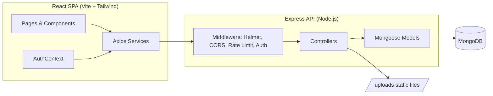

# System Architecture

- The client is a single-page React app served independently (dev: Vite dev server on 5173; prod: static build).
- The server exposes a versionless REST API under `/api`.
- Uploaded images are stored on disk under `/uploads` and served statically; only metadata (filename, url, mimetype, size) is stored in MongoDB.
- Authentication is stateless JWT — no server-side session store.
