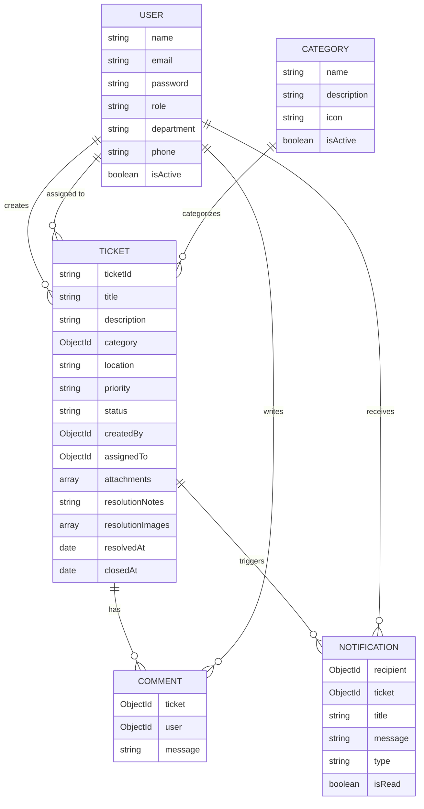

# MongoDB Data Model

## Notes

- `ticketId` (e.g. `CFX-2026-0001`) is generated atomically via a per-year `Counter` document, avoiding collisions under concurrent ticket creation.
- Indexes: `Ticket.status`, `Ticket.createdBy`, `Ticket.assignedTo`, `Ticket.createdAt`, plus a text index across `title`/`description`/`ticketId` for search.
- Passwords are bcrypt-hashed in a `pre('save')` hook and stripped from `toJSON()` output.
