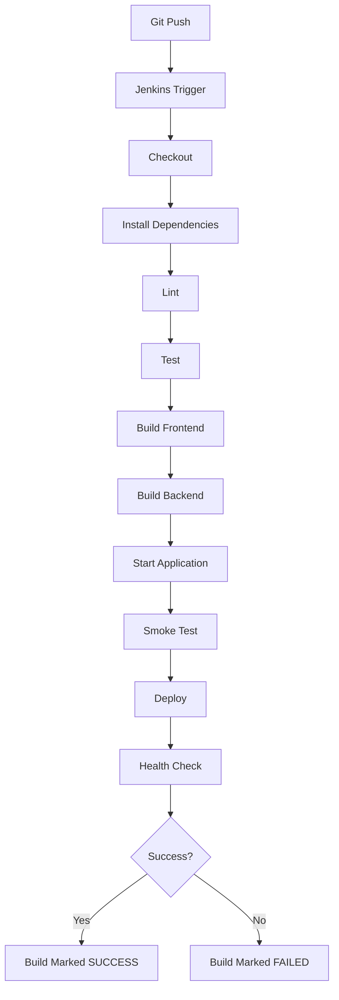

# Jenkins CI/CD

## Required Jenkins setup

- **Agent tooling:** Git, Node.js 18+, npm. No Docker required or used anywhere.
- **Credentials** (Jenkins → Manage Credentials), referenced in the `Jenkinsfile` via `credentials()`:
  - `campusfix-mongo-uri` — MongoDB Atlas (or reachable) connection string
  - `campusfix-jwt-secret` — a long random string, separate from any local `.env`
- **Trigger:** configure a GitHub/GitLab webhook, or poll SCM, so a `git push` starts the pipeline automatically.

## Running it

1. Create a Pipeline job in Jenkins pointing at this repository, using the `Jenkinsfile` at the repo root ("Pipeline script from SCM").
2. Add the two credentials above under the exact IDs used in the `Jenkinsfile`.
3. Push to `main` (or trigger a build manually) — Jenkins runs Checkout → Install → Lint → Test → Build Frontend → Build Backend → Start Application → Smoke Test → Deploy (only on `main`) → Health Check.
4. Any stage failure (bad dependency, lint error, failing test, build error, app failing to start, failed health check) marks the build **FAILED** and stops the pipeline.

## What's stubbed vs. real

The `Deploy` stage is a documented placeholder: it does not push to Vercel/Netlify/Render/Railway because that requires your own hosting accounts and credentials. Everything before it (install, lint, test, build, start, smoke test) is fully real and will fail the build on a genuine problem.
