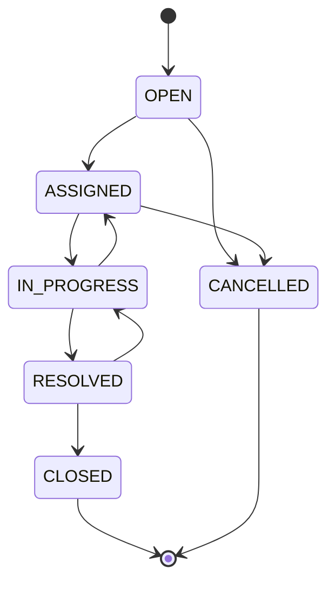

# Ticket Lifecycle

Transitions are enforced in `Ticket.canTransition(from, to)` (`server/src/models/Ticket.js`) and checked again inside `ticketController.changeStatus` / `resolveTicket` before any write — the frontend's dropdown options are a convenience, not the source of truth. An invalid request (e.g. `CLOSED → OPEN`) returns `409 Conflict`.
